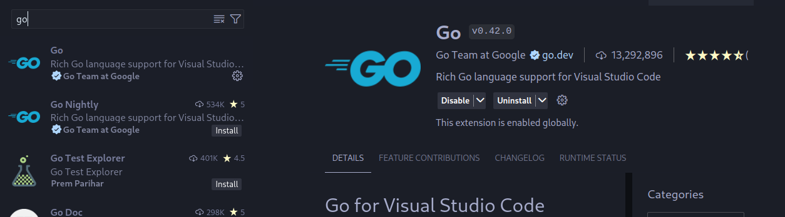

# Getting Started with Go Programming on Apple Silicon Macs

## Introduction

Welcome to the world of Go programming! This guide will walk you through the process of setting up Go on your Apple Silicon Mac, creating your first program, and taking your initial steps into the Go ecosystem. By the end of this tutorial, you'll have a solid foundation to begin your Go programming journey.

## Step 1: Installing Go

1. Visit the [official Go website](https://golang.org/dl/).
2. Download the ARM64 version designed for Apple Silicon.
3. Run the installer and follow the prompts to complete the installation.

## Step 2: Setting Up Visual Studio Code

Visual Studio Code (VS Code) is a popular, lightweight code editor that works excellently with Go.

1. If you haven't already, download and install [VS Code](https://code.visualstudio.com/).
2. Open VS Code and navigate to the Extensions panel (Cmd+Shift+X).
3. Search for "Go" and install the official Go extension by Google.



## Step 3: Creating Your First Go Project

Let's set up a workspace for your Go project:

1. Open VS Code.
2. Click "Open Folder" and create a new folder for your project.
3. Open the integrated terminal in VS Code (Terminal > New Terminal).
4. Navigate to your project folder using the `cd` command.
5. Initialize a Go module:

```bash
go mod init hello
```

6. Create a new file named `hello.go` in your project folder.

## Step 4: Writing Your First Go Program

Let's write a classic "Hello, World!" program:

1. Open `hello.go` in VS Code.
2. Add the following code:

```go
package main

import "fmt"

func main() {
    fmt.Println("Hello, World!")
}
```

## Step 5: Running Your Go Program

Now, let's see your program in action:

1. In the VS Code terminal, ensure you're in your project folder.
2. Run the program:

```bash
go run hello.go
```

You should see "Hello, World!" printed in the terminal.

## Step 6: Creating an Executable

To create a standalone executable:

1. In the terminal, navigate to your project folder.
2. Build the executable:

```bash
go build hello.go
```

This will create an executable file named `hello` in your project folder.

## Conclusion

Congratulations! You've successfully set up Go on your Apple Silicon Mac, configured VS Code, and written your first Go program. This is just the beginning of your Go programming journey.

## Next Steps

- Explore Go's [official documentation](https://golang.org/doc/) to learn more about the language's features.
- Try building small projects to reinforce your learning.
- Take a look at [go by example](https://gobyexample.com/) to see practical examples of Go code
- Join Go [community forums](https://forum.golangbridge.org/) or slack channels to connect with other Go developers

Happy coding, and welcome to the Go community!
